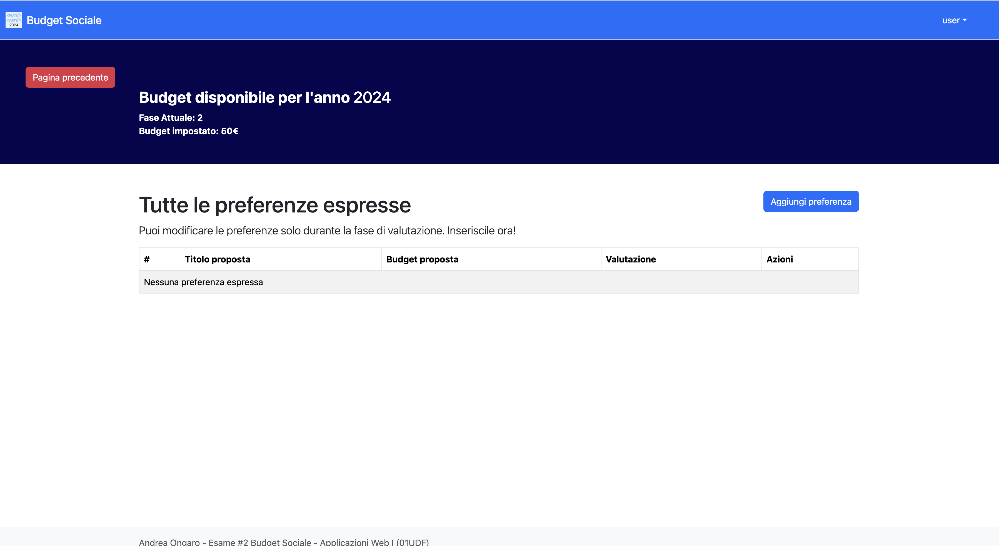

[](https://classroom.github.com/a/OLXYiqlj)

# Exam #2: "Budget Sociale"

## Student: s329706 Ongaro Andrea

## React Client Application Routes

- Route `/`:

   - Displays different content based on the user’s login status and the workflow phase.
   - If the user is logged in:

      - Phase 0: Displays a card to create the budget if the user is an admin; otherwise, shows a message to wait for the budget to be created.
      - Phase 1: Displays cards to navigate to the proposals page.
      - Phase 2: Displays cards to navigate to both the proposals page and preferences page.
      - Phase 3: Displays cards to navigate to both the proposals page and preferences page.

   - If the user is not logged in:

      - Phases 0, 1, 2: Displays a message indicating that the budget is currently under definition.
      - Phase 3: Displays a message indicating that proposals have been accepted.

- Route `/budgets/`:

   - Shows the form to create a budget. This form is inaccessible after the budget is created.

- Route `/proposals/`:

   - Displays proposals based on the current phase:
      - Phase 1: Shows only the user’s proposals, with options to delete or edit.
      - Phase 2: Displays all proposals with the ability to view either only the user’s proposals or all proposals.
      - Phase 3: Shows all proposals with filters and voting information.

- Route `/proposals/create`:

   - Provides a form to create a proposal, including adding a description and budget. This functionality is only available during Phase 1.

- Route `/proposals/:id`:

   - Displays a form to edit the selected proposal. This functionality is only available during Phase 1.

- Route `/preferences/`:

   - Displays all preferences made by the logged-in user, with a button to create new preferences.

- Route `/preferences/:id`:

   - Shows a form to edit the selected preference. This functionality is only available during Phase 2.

- Route `/preferences/create`:

   - Provides a form to create a preference, including adding a description and budget. This functionality is only available during Phase 1.

## API Server

- POST `/api/sessions`
- description: login in the application
- permission: None
- request body:

   - username: string
   - password: string

- response body:
- 200: Information about the logged user:

```json {"id":"01J2K47Z225DK1V5TF8W9SEM2G"}
{
   "id": 9,
   "username": "andrea_ongaro",
   "role": "user",
   "createdAt": "2024-07-09 10:15:50"
}
```

- 401: `{ "message" : 'Incorrect username or password' }`
- 500: ` { "message": "server error" }`
- GET `/api/sessions/current`
- description: Check if the user is logged
- permission: Logged user
- request body:
- response body:
- 200: Information about the logged user:

```json {"id":"01J2K47Z225DK1V5TF8XBC814R"}
{
   "id": 9,
   "username": "andrea_ongaro",
   "role": "user",
   "createdAt": "2024-07-09 10:15:50"
}
```

- 401: `{ "message" : "Not authenticated" }`
- 500: ` { "message": "server error" }`
- DELETE `/api/sessions/current`

   - description: Destroy the user session
   - permission: Logged user
   - request body: None
   - response body:
      - 200: None
      - 401: `{ "message" : "Errors" }`
      - 500: ` { "message": "server error" }`

- POST `/api/sign_in`

   - description: Create the user
   - permission: None
   - request body:

      - username: string
      - password: string

   - response body:

      - 201: None
      - 409: `{ "message": "User already exists"}`
      - 422: `{ "message": "Missing fields"}`
      - 500: ` { "message": "server error" }`

- POST `/api/budgets`
- description: Create the budget for the current year
- permission: Admin
- request body content

   - value: numeric value

- response body content:
- 201: None
- 401: `{ "message": "Not authenticated" }`
- 409: `{ "message" : "Budget for this year already exists" }`
- 422:

```json {"id":"01J2K47Z225DK1V5TF90JMECBR"}
{
   "message": "title Invalid value, budget Invalid value"
}
```

- 500: `{ "message" : "description of the server error" }`
- GET `/api/budgets/current`
- description: Get the information of the current year budget
- permission: None
- request body content: None
- response body content
- 200: Information about the current budget:

```json {"id":"01J2K47Z225DK1V5TF942046B1"}
{ 
   "data": {
      "id": 10,
      "year": 2024,
      "value": 32,
      "phase": 1,
      "createdBy": 4,
      "createdAt": "2024-07-06 15:48:08",
      "updatedAt": "2024-07-06 15:48:08"
   },
   "message": "Current budget successfully retrieved"
   }
```

- 401: `{ "message: "Not authenticated" }`
- 404: `{ message: "Budget not found" }`
- 500: `{ "message" : "description of the server error" }`
- PUT `/api/budgets/current/next`

   - description: Go to the next phase
   - permission: Admin
   - request body content

      - value: numeric value

   - response body content:

      - 204: None
      - 401: `{ "message": "Not authenticated" }`
      - 403: `{ "message": "Budget is already in phase 3" }`
      - 404: `{ message: "Budget not found" }`
      - 500: `{ "message" : "description of the server error" }`

- DELETE `/api/budgets/current`

   - description: Reset current budget
   - permission: Logged user (Admin)
   - request body content:
      - 204: None
      - 401: `{ "message: "Not authenticated" }`
      - 403: `{ "message: "Budget is not in phase 3" }`
      - 404: `{ message: "Budget not found" }`
      - 500: `{ "message" : "description of the server error" }`

- POST `/api/proposals/`

   - description: Create a proposal for the current year budget
   - permission: Logged user (Normal user - Admin)
   - request body content:

      - title: string
      - budget: numeric

   - response body content

      - 201: No Body
      - 400: `{ "message": "Amount is greater than budget value"}`
      - 401: `{ "message": "Not authenticated" }`
      - 403: `{ "message": "Budget is not in the proposal phase"}`
      - 409: `{ "message": "User already has three proposals for this budget or There is already a proposal with the same title"}`
      - 422: `{
         "message": {
         "title": "Invalid value"
         }
         }`
      - 500: `{ "message" : "description of the server error" }`

- GET `/api/proposals/`
- description: Get all the proposals that the user should depending of the fact that is logged or not and the phase the budget is currently in
- permission: None
- request body content: None
- response body content
- 200 : Array list of proposals:

```json {"id":"01J2K47Z225DK1V5TF9518DVR6"}
{
   "data": [
   {
      "id": 18,
      "title": "ss2",
      "budget": 3,
      "accepted": 0,
      "budgetID": 10,
      "createdBy": 4,
      "user": {
      "id": 4,
      "username": "andrea_ongaro"
   },
   "createdAt": "2024-07-06 20:56:32",
   "updatedAt": "2024-07-06 20:56:32"
   }
   ],
   "message": "Proposals successfully retrieved"
   }
```

- 401: `{ "message": "Not authenticated" }`
- 404 : `{ "message": "Budget not found" }`
- 500 : `{ "message" : "description of the server error" }`
- GET `/api/proposals/:id`

   - description: get the proposal by the id
   - permission: Logged user (Normal user - Admin)
   - request body content: None
   - Request query parameter:
   - response body content
   - 201: Proposal object:

```json {"id":"01J2K47Z225DK1V5TF98VNYQGF"}
{
   "data": {
      "id": 18,
      "title": "ss2",
      "budget": 3,
      "accepted": 0,
      "budgetID": 10,
      "createdBy": 4,
      "user": {
         "id": 4,
         "username": "andrea_ongaro"
      },
      "createdAt": "2024-07-06 20:56:32",
      "updatedAt": "2024-07-06 20:56:32"
   },
   "message": "Proposal successfully retrieved"
}
```

- 401: `{ "message": "Not authenticated or User is not the creator of this proposal" }`
- 404: `{ "message": "Proposal not found" }`
- 500: `{ "message" : "description of the server error" }`
- PUT `/api/proposals/:id`

   - description: Update the value of the budget of the proposal
   - permission: Logged user (Normal user - Admin)
   - request body content:

      - value: numeric value

   - response body content

      - 204: None
      - 401: `{ "message": "Not authenticated or User is not the creator of this proposal" }`
      - 404:  `{"message": "Proposal not found" } `
      - 409: `{ "message": "There is already a proposal with the same title"}`
      - 422: `{ "message": "id invalid value"}`
      - 500: `{ "message" : "description of the server error" }`

- DELETE `/api/proposals/:id`

   - description: Remove the proposal
   - permission: Logged user (Normal user - Admin)
   - request body content: None
   - response body content
      - 204: None
      - 401: `{ "message": "Not authenticated or User is not the creator of this proposal" }`
      - 404:  `{"message": "Proposal not found" } `
      - 422: `{ "message": "id invalid value"}`
      - 500: `{ "message" : "description of the server error" }`

- POST `/api/preferences/`

   - description: Add a new preference. It checks if it's already created the preferences for the proposal selected
   - permission: Logged user (Normal user - Admin)
   - request body content:

      - value: integer value between 1 and 3
      - proposalID: integer

   - response body content

      - 201: None
      - 401: `{ "message": "Not authenticated" }`
      - 403: `{ "message": "Budget is not in the preference phase" }`
      - 404:  `{"message": "Proposal not found or Budget Not Found" } `
      - 409: `{ "message": Preference already exists for this proposal" }`
      - 422: `{ "message": "proposalID invalid value"}`
      - 500: `{ "message" : "description of the server error" }`

- GET `/api/preferences/`
- description: Get the preferences of the logged user
- permission: Logged user (Normal user - Admin)
- request body content: None
- response body content
- 200: Array of preferences:

```json {"id":"01J2K47Z225DK1V5TF9A87999W"}
{
   "data": [
      {
         "id": 27,
         "title": "PROPOSTA_DA_ADMIN",
         "budget": 444,
         "accepted": 0,
         "budgetID": 12,
         "createdBy": 6,
         "createdAt": "2024-07-07 18:34:11",
         "updatedAt": "2024-07-07 18:34:11"
      },
   ],
   "message": "Proposals successfully retrieved"
}
```

- 401: `{ "message": "Not authenticated" }`
- 403: `{ "message": "Budget is not in the preference phase" }`
- 404:  `{"message": "Budget not found" } `
- 500: `{ "message" : "description of the server error" }`
- GET `/api/preferences/:id`
- description: Get preference by the id
- permission: Owner of the preference
- request body content: None
- response body content
- 200: Preference object:

```json {"id":"01J2K47Z225DK1V5TF9BTJ4SRS"}
{
   "data": {
      "id": 27,
      "title": "PROPOSTA_DA_ADMIN",
      "budget": 444,
      "accepted": 0,
      "budgetID": 12,
      "createdBy": 6,
      "createdAt": "2024-07-07 18:34:11",
      "updatedAt": "2024-07-07 18:34:11"
   },
   "message": "Proposals successfully retrieved"
}
```

- 401: `{ "message": "Not authenticated or Not authorized to access this preference" }`
- 404: `{ "message": "Preference not found or Budget not found" }`
- 500: `{ "message" : "description of the server error" }`
- GET `/api/preferences/proposals`
- description: Get the proposals that should are not created by the logged user and the proposals that has no preferences created by the current user
- permission: Logged user (Normal user and admin user)
- request body content: None
- response body content
- 200: Proposal object:

```json {"id":"01J2K47Z225DK1V5TF9DAKADDY"}
{
   "data": [
      {
         "id": 27,
         "title": "PROPOSTA_DA_ADMIN",
         "budget": 444,
         "accepted": 0,
         "budgetID": 12,
         "createdBy": 6,
         "createdAt": "2024-07-07 18:34:11",
         "updatedAt": "2024-07-07 18:34:11"
      },
      {
      "id": 28,
      "title": "PROPOSTA_DA_ADMIN2",
      "budget": 444,
      "accepted": 0,
      "budgetID": 12,
      "createdBy": 6,
      "createdAt": "2024-07-07 18:34:21",
      "updatedAt": "2024-07-07 18:34:21"
      }
   ],
   "message": "Proposals successfully retrieved"
}
```

- 401: `{ "message": "Not authenticated" }`
- 403: `{ "message": "Budget is not in the preference phase" }`
- 404: `{ "message": "Preference not found" }`
- 500: `{ "message": "description of the server error" }`
- PUT `/api/preferences/:id`
- description: update the value of the preference
- permission: Owner of the preferences
- request body content:

   - value: integer value between 1 and 3

- response body content
- 204: None
- 401: `{ "message: "Not authenticated or Not authorized to access this preference" }`
- 403: `{ "message": "Budget is not in the preference phase" }`
- 404: `{ "message": "Preference not found or budget not found" }`
- 422:

```json {"id":"01J2K47Z235GJHXMN2THSQFFBN"}
{
   "message": {
      "id": "Invalid value"
   }
}
```

- 500: `{ "message" : "description of the server error" }`
- DELETE `/api/preferences/:id`

   - description: delete the preference
   - permission: Owner of the preferences
   - request body content: None
   - response body content
      - 204: None
      - 401: `{ "message": "Not authenticated" }`
      - 403: `{ "message": "Budget is not in the preference phase" }`
      - 404: `{ "message": "Preference not found or budget not found" }`
      - 500: `{ "message" : "description of the server error" }`

## Database Tables

- Table `users`

   - id: INTEGER AUTOINCREMENT
   - username: TEXT NOT NULL
   - password: TEXT NOT NULL
   - salt: TEXT NOT NULL
   - createdAt:TEXT NOT NULL

- Table `budgets`

   - id: INTEGER AUTOINCREMENT
   - value: INTEGER NOT NULL,
   - year: INTEGER NOT NULL,
   - phase: INTEGER NOT NULL,
   - createdBy: INTEGER NOT NULL,
   - createdAt: TEXT NOT NULL
   - updatedAt: TEXT NOT NULL

- Table `proposals`

   - id: INTEGER AUTOINCREMENT
   - title: TEXT NOT NULL
   - budget: INTEGER NOT NULL,
   - budgetID: INTEGER NOT NULL (foreign key on budgets.id)
   - total preferences: INTEGER NOT NULL,
   - accepted: INTEGER NOT NULL (possible value 0, 1)
   - createdBy: INTEGER NOT NULL (foreign key on users.id)
   - createdAt: TEXT NOT NULL
   - updatedAt: TEXT NOT NULL

- Table `preferences`

   - id: INTEGER AUTO INCREMENT
   - value: INTEGER NOT NULL,
   - proposalID:  INTEGER NOT NULL,
   - createdBy: INTEGER NOT NULL (foreign key on users.id)
   - createdAt: TEXT NOT NULL
   - updatedAt: TEXT NOT NULL

## Main React Components

- `LoginForm` (in `auth/LoginForm.jsx`):

   - Displays the form to login in the application and handle the login

- `BudgetStatusBarLayout` (in `budgets/PageLayout.jsx`):

   - Displays the current budget information and includes “Reset” and “Next Phase” buttons if they are applicable.

- `BudgetForm` (in `budgets/BudgetForm.jsx`):

   - Displays the form to create the budget including the validation

- `Header` (in `common/Header.jsx`):

   - Displays the header with the login button if the user is not logged in otherwise a dropdown toggle where view the user logged in and the logout button

- `Footer` (in `common/Footer.jsx`):

   - Displays the footer

- `NotLoggedInLayout` (in `homepage/NotLoggedInLayout.jsx`):

   - Displays content based on the current phase. In the Phase 3 it displays the list of the proposals accepted otherwise a text

- `ProtectedLayout` (in `homepage/ProtectedLayout.jsx`):

   - Protect routes to ensure they are accessible only to logged-in users.

- `PageLayout` (in `homepage/HomePageLayout.jsx`):

   - Display content base on the current phase.
      - Phase 0: Displays a card to create the budget if the user is an admin; otherwise, shows a message to wait for the budget to be created.
         - Phase 1: Displays cards to navigate to the proposals page.
         - Phase 2: Displays cards to navigate to both the proposals page and preferences page.
         - Phase 3: Displays cards to navigate to both the proposals page and preferences page.

- `PreferencenForm` (in `preferences/PreferenceForm.jsx`):

   - Display the form to create and edit the preference with the validation

- `CreatePreferenceLayout` (in `preferences/PreferencePageLayout.jsx`):

   - Manage the layout for creating preferences.

- `EditPreferenceLayout` (in `preferences/PreferencePageLayout.jsx`):

   - Manage the layout for editing preferences.

- `PreferenceListLayout` (in `preferences/PreferencePageLayout.jsx`):

   - Manage the layout for displaying preferences.

- `PreferenceList` (in `Auth/LoginForm.jsx`):

   - Display the form to create and edit the proposal.

- `ProposalForm` (in `Auth/LoginForm.jsx`):

   - Display the form to create and edit the proposal with the validation

- `CreateProposalLayout` (in `proposals/ProposalPageLayout.jsx`):

   - Manage the layout for creating proposals.

- `EditProposalLayout` (in `proposals/ProposalPageLayout.jsx`):

   - Manage the layout for editing proposals.

- `ProposalListLayout` (in `proposals/ProposalPageLayout.jsx`):

   - Manage the layout for displaying proposals.

## Screenshot




## Users Credentials

|         username         |   role   | plain-text password |
|-----------------------|----------|---------------------|
|  admin   | admin     | admin            |
| luigi_de_russis | user    | luigi_de_russis            |
| luca_mannella    | user | luca_mannella            |
| andrea_ongaro    | user | andrea_ongaro            |
|-----------------------|----------|---------------------|
